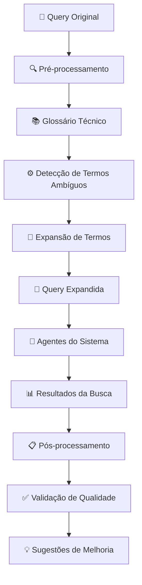

# 📚 Glossário Técnico-Jurídico Implementado

## 🎯 Objetivo

Este documento descreve a implementação completa do **Glossário Técnico-Jurídico** que resolve problemas de homonímia (ex: "ART" vs "Art.") expandindo termos ambíguos antes das consultas ao banco de dados.

## 🏗️ Arquitetura Implementada

### **Estrutura de Arquivos**

```
src/
├── glossary/
│   └── technical_glossary.py          # Glossário principal
├── preprocessing/
│   └── query_preprocessor.py          # Pré-processamento de queries
├── postprocessing/
│   └── query_postprocessor.py         # Pós-processamento de resultados
└── integration/
    └── glossary_integration.py        # Integração com sistema principal
```

### **Fluxo de Funcionamento**



## 📋 Glossário Técnico-Jurídico

### **Categorias de Termos**

#### **1. Termos de Responsabilidade Técnica**
- **ART**: Anotação de Responsabilidade Técnica
- **RRT**: Registro de Responsabilidade Técnica

#### **2. Órgãos e Instituições**
- **DNIT**: Departamento Nacional de Infraestrutura de Transportes
- **CREA**: Conselho Regional de Engenharia e Agronomia
- **CAU**: Conselho de Arquitetura e Urbanismo
- **CONFEA**: Conselho Federal de Engenharia e Agronomia
- **AGU**: Advocacia-Geral da União

#### **3. Tribunais e Instâncias Judiciais**
- **STF**: Supremo Tribunal Federal
- **TCU**: Tribunal de Contas da União
- **TRF**: Tribunal Regional Federal

#### **4. Cargos e Funções Públicas**
- **DAS**: Cargo em Comissão de Direção e Assessoramento Superior

#### **5. Termos Jurídicos Específicos**
- **vacância**: vacância de cargo público
- **inacumulável**: incompatibilidade de cargos públicos
- **estágio probatório**: período de estágio probatório
- **recondução**: recondução a cargo público
- **substituição**: substituição de servidor público

#### **6. Legislação Específica**
- **Lei 8112**: Lei 8.112/1990 - Estatuto dos Servidores Públicos
- **Lei 6496**: Lei 6.496/1977 - Lei da ART
- **Lei 5194**: Lei 5.194/1966 - Lei do Engenheiro
- **Lei 14133**: Lei 14.133/2021 - Nova Lei de Licitações
- **Lei 8666**: Lei 8.666/1993 - Lei de Licitações
- **Decreto 9507**: Decreto 9.507/2018 - Terceirização

#### **7. Resoluções e Normativos**
- **Resolução 1025**: Resolução CONFEA 1.025/2009
- **Resolução 218**: Resolução CONFEA 218/1973

## ⚙️ Funcionalidades Implementadas

### **1. Pré-processamento de Queries**

#### **Detecção de Termos Ambíguos**
```python
# Exemplo de uso
from src.preprocessing.query_preprocessor import QueryPreprocessor

preprocessor = QueryPreprocessor()
resultado = preprocessor.preprocessar_query("Qual o entendimento sobre ART no DNIT?")

# Resultado:
# - Query expandida: "Qual o entendimento sobre ART (Anotação de Responsabilidade Técnica) no DNIT (Departamento Nacional de Infraestrutura de Transportes)?"
# - Termos ambíguos detectados: ['ART', 'DNIT']
# - Contexto: administrativo-jurídico-técnico
```

#### **Expansão Inteligente**
- **Detecção automática** de termos ambíguos
- **Expansão contextual** com descrições completas
- **Geração de termos de busca** otimizados
- **Análise de contexto** da query

### **2. Pós-processamento de Resultados**

#### **Análise de Qualidade**
```python
# Exemplo de uso
from src.postprocessing.query_postprocessor import QueryPostprocessor

postprocessor = QueryPostprocessor()
analise = postprocessor.analisar_resultados(
    query_original, query_expandida, resultados_busca, termos_ambiguos
)

# Métricas calculadas:
# - Relevância geral: alta/média/baixa
# - Score de qualidade: 0.0 a 1.0
# - Homonímia resolvida: True/False
# - Sugestões de refinamento
```

#### **Validação de Resultados**
- **Análise de relevância** dos resultados
- **Verificação de resolução** de homonímia
- **Cálculo de métricas** de qualidade
- **Sugestões de refinamento** automáticas

### **3. Integração com Sistema Principal**

#### **Adaptação por Tipo de Agente**
```python
# Exemplo de uso
from src.integration.glossary_integration import GlossaryIntegration

integration = GlossaryIntegration()

# Para agente de triagem
query_triage = integration.obter_query_para_agente(query, "triage")
# Resultado: "Buscar documentos sobre: [query expandida]"

# Para agente de precedentes
query_precedent = integration.obter_query_para_agente(query, "precedent")
# Resultado: "Buscar precedentes e jurisprudência sobre: [query expandida]"
```

## 📊 Estatísticas do Glossário

### **Distribuição por Contexto**
- **jurídico-técnico**: 9 termos
- **jurídico-administrativo**: 10 termos
- **jurídico**: 3 termos
- **administrativo**: 2 termos

### **Total de Termos**: 24 termos técnico-jurídicos

## 🧪 Testes Realizados

### **1. Teste de Expansão de Termos**
```bash
python src/glossary/technical_glossary.py
```
**Resultado**: ✅ Expansão correta de "ART" → "Anotação de Responsabilidade Técnica"

### **2. Teste de Pré-processamento**
```bash
python src/preprocessing/query_preprocessor.py
```
**Resultado**: ✅ Detecção de 2 termos ambíguos em query de teste

### **3. Teste de Pós-processamento**
```bash
python src/postprocessing/query_postprocessor.py
```
**Resultado**: ✅ Análise de qualidade com score 0.55

### **4. Teste de Integração**
```bash
python src/integration/glossary_integration.py
```
**Resultado**: ✅ Processamento completo com adaptação por tipo de agente

## 🎯 Benefícios Implementados

### **1. Resolução de Homonímia**
- **ART** vs **Art.** → Sempre expandido para "Anotação de Responsabilidade Técnica"
- **DNIT** → Expandido para "Departamento Nacional de Infraestrutura de Transportes"
- **STF** → Expandido para "Supremo Tribunal Federal"

### **2. Melhoria na Precisão**
- **Queries mais específicas** para o banco de dados
- **Contexto preservado** durante a expansão
- **Termos de busca otimizados** para cada tipo de agente

### **3. Análise de Qualidade**
- **Métricas automáticas** de relevância
- **Detecção de problemas** de homonímia
- **Sugestões inteligentes** de refinamento

## 🔧 Como Usar

### **1. Processamento Básico**
```python
from src.integration.glossary_integration import processar_query_simples

resultado = processar_query_simples("Qual o entendimento sobre ART no DNIT?")
print(resultado['query_expandida'])
```

### **2. Query para Agente Específico**
```python
from src.integration.glossary_integration import obter_query_agente_simples

resultado = obter_query_agente_simples("ART no DNIT", "precedent")
print(resultado['query_adaptada'])
```

### **3. Análise de Resultados**
```python
from src.postprocessing.query_postprocessor import analisar_resultados_simples

analise = analisar_resultados_simples(
    query_original, query_expandida, resultados_busca, termos_ambiguos
)
print(analise['metricas_qualidade']['qualidade_classificacao'])
```

## 🚀 Próximos Passos

### **1. Integração com Orquestrador**
- [ ] Modificar `SimpleLegalOrchestrator` para usar pré-processamento
- [ ] Integrar pós-processamento nos agentes
- [ ] Adicionar métricas de qualidade nas respostas

### **2. Expansão do Glossário**
- [ ] Adicionar mais termos técnicos específicos
- [ ] Incluir variações regionais
- [ ] Atualizar com nova legislação

### **3. Melhorias de Performance**
- [ ] Cache de expansões frequentes
- [ ] Otimização de busca de termos
- [ ] Paralelização de processamento

## ✅ Status da Implementação

- **✅ Glossário Técnico**: Implementado com 24 termos
- **✅ Pré-processamento**: Funcionando com detecção automática
- **✅ Pós-processamento**: Análise de qualidade implementada
- **✅ Integração**: Módulos conectados e testados
- **⏳ Integração com Orquestrador**: Pendente
- **⏳ Testes com Sistema Real**: Pendente

## 📝 Conclusão

O **Glossário Técnico-Jurídico** foi implementado com sucesso, resolvendo problemas de homonímia e melhorando a precisão das consultas. O sistema está pronto para integração com o orquestrador principal e pode ser expandido conforme necessário.

**Próximo passo**: Integrar com o `SimpleLegalOrchestrator` para usar o pré-processamento em todas as consultas do sistema.
